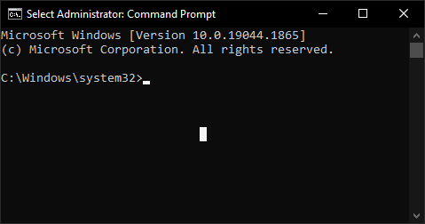

---
hide:
  - navigation
---

# Not ReviOS related questions

## Internet/Sound/Bluetooth/other hardware... not working

Install the driver. Help: [How to install drivers page](drivers.md)

### I do not have internet after installing ReviOS

You probably did not follow the ReviOS installation guide, where we recommend to download your driver before installation, exactly because of this situation. Use an other computer or if your phone has mobileinternet, use USB tethering, to download the network driver. More help finding the drivers on the [How to install drivers page](drivers.md).

<!-- ## If you do not have internet...

... is probably because you are missing the network drivers. Somehow (like on another computer or by connecting your phone to your pc to use USB tethering) download [Snappy Driver Installer Origin](https://www.snappy-driver-installer.org/){target=_blank}. 

Extract it, and start the software with `SDIO_auto.bat`. Then select the `Download Network Drivers Only` option. It will start the download of all the existing network drivers. 

If it finishes (you can monitor the process on the top side of the window), copy the whole folder to the other computer which doesn't have internet. Open on that computer the software, and install the missing network drivers. Or, if you used USB tethering, you can disconnect your phone and install your network drivers right away. After restart, you can scan the PC for more missing drivers, or better yet, go to the manufacturer's website, and download the drivers from there. -->

---

## Installation stoped with an error

First, verify the ISO. You can find the checksums on the [Verification page of the Revision website](https://www.revi.cc/revios/download/verify). You can get help with the verification in the [installation guide](install.md#verification)'s section about it.

And if you use Rufus, switch to Ventoy. Help in the [installation guide](install.md#ventoy).

If the installation needs a driver, please refer the [installation guide](install.md#missing-drivers).

---

## The "Do not close the window, otherwise your system won't work properly" window not closing

Make sure you did not select a character in the command prompt (a **white rectangle**). This puts the terminal window in selection mode and pauses the running of the script. **Press Esc** or Enter, and the script will continue. If you are not sure, but the window title has the "Select" word (see the example), it is definitely in selection mode.

<figure markdown>
  
  <figcaption>Example image. The selection is in the middle of the terminal window</figcaption>
</figure>

---

## Second monitor not working/blank or refresh rate not desired

Install GPU drivers.

Help to install: [How to install drivers page](drivers.md)

Help to tweak: [ReviOS Post-Install guide on the Revision website](https://www.revi.cc/revios/post-install#h.p_GR11WmefRS4F){target=_blank}

---

## Can I download other languages?

Yes, in the Settings. If that is not working, follow the [guide about language installation on the Revision website](https://www.revi.cc/revios/workspace/lang){target=_blank}.

---

## There are some visual bugs on the taskbar in ReviOS 11

These bugs came from Windows 11, hope they will be fixed in next Microsoft update releases.

In the meantime, try [StartAllBack](https://www.startallback.com/){target=_blank}.

---

## Downloads are not working / Google Drive: "Sorry, you can't view or download this file at this time." / MEGA quota exceeded

Check our [official Discord server's](https://discord.gg/962y4pU){target=_blank} [download channel](https://discord.com/channels/619835916139364383/658369065110339640){target=_blank} and [website](https://www.revi.cc/revios/download){target=_blank} for alternative download links.