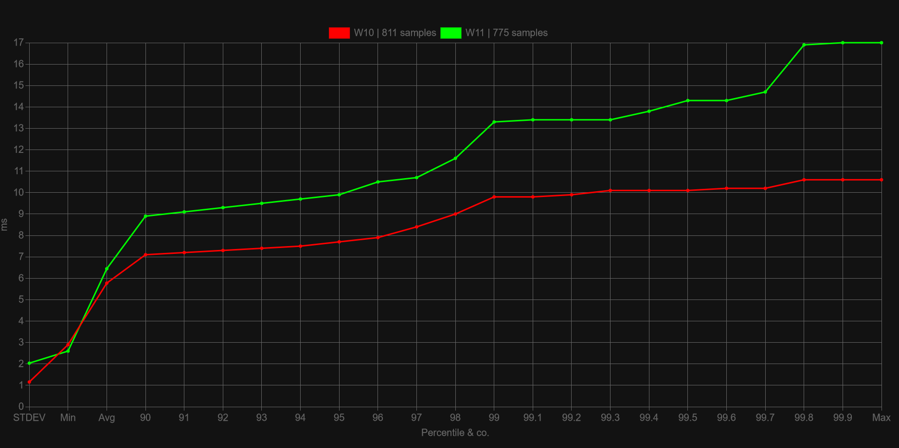
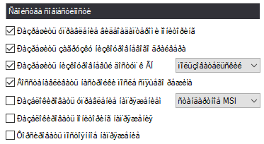
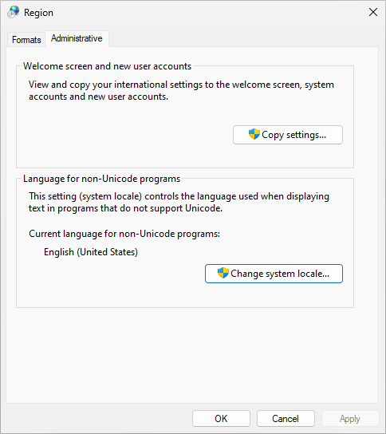

---
hide:
  - navigation
---

<style>
    div.admonition p:not(.admonition-title) {
        font-size: 125%;
    }
    .center {
        display: block;
        margin-left: auto;
        margin-right: auto;
    }
</style>

# ReviOS related questions

## What is the difference between the versions?

As of this moment (2022-10-28), there are only 2 versions of ReviOS that are supported: `10 22.10` and `11 22.10`. No other versions or builds are supported.

=== "ReviOS 10 22.09"

    Based on the latest Windows 10 Pro (19045.2193), released on 28th of October 2022.

    Recommended for older systems, incompatible with Windows 11.

    [Changelog](https://www.revi.cc/revios/download/changelog#h.5m29vb11epyy){target=_blank}

    [Download](https://www.revi.cc/revios/download#h.vxvav5mpn4w){target=_blank}

    Alternative download links on the official [Discord](https://discord.gg/962y4pU){target=_blank} server's [download channel](https://discord.com/channels/619835916139364383/658369065110339640/1035618788965613659){target=_blank}.


=== "ReviOS 11 22.09"

    Based on the latest Windows 11 Pro (22621.755), released on 28th of October 2022.

    Recommended for newer systems with more recent hardware.

    [Changelog](https://www.revi.cc/revios/download/changelog#h.5m29vb11epyy){target=_blank}

    [Download](https://www.revi.cc/revios/download#h.kwa7bvvnrtc9){target=_blank}

    Alternative download links on the official [Discord](https://discord.gg/962y4pU){target=_blank} server's [download channel](https://discord.com/channels/619835916139364383/658369065110339640/1035618788965613659){target=_blank}.


**For FACEIT we always recommend to use the latest builds of ReviOS.** [Details below](#is-revios-faceit-compatible-which-build-do-i-need-for-faceit).

### Which build of ReviOS is the best?

Even if you do find **older builds of ReviOS, we do not recommend** using those, since they are outdated. Maybe ancient builds have a slightly better latency or speed, but the number of software that supports those are declining day by day. And ReviOS is getting better with every release.

So always **install the latest**, because that is the best.

### Which version of ReviOS is the best? ReviOS 10 or ReviOS 11?

These two versions of ReviOS have very little difference between them, and it mainly boils down to **what do you like more**. Windows 10 or Windows 11. Although **DirectX 12 games** and latest **Intel** processors, like the **12th generation**, might perform better on **Windows 11**, due to [DirectStorage](https://www.thewindowsclub.com/what-is-directstorage-in-windows){target=_blank}, [BypassIO](https://docs.microsoft.com/en-us/windows-hardware/drivers/ifs/bypassio){target=_blank} and [Thread Director](https://www.anandtech.com/show/16881/a-deep-dive-into-intels-alder-lake-microarchitectures/2){target=_blank}, these are not ReviOS related things, these differences are present on stock Windows too.

Also, if you plan on using anti-cheat systems like FACEIT or Vanguard, you must enable Secure Boot and TPM, regardless that ReviOS 11 skips the check when installing, so if your hardware does not support it, use ReviOS 10.

And if you care about latency, Windows 10 still provides a better experience.

<figure markdown>
  {width=600px}
  <figcaption>Graph shows the latency of <b>Windows 10 LTSC 21H2 19044.1288</b> and <b>Windows 11 22H2 22621.105</b>. Tested with Intel i7-10700KF and GTX 1070TI by Muren#6968.<br>Click the image to open it</figcaption>
</figure>

### Why are there two ISO files for each ReviOS version?

One for installing a completely new ReviOS instance, and one for upgrading a previous ReviOS. Read more at [How can I upgrade to the newest build of ReviOS?](#how-can-i-upgrade-to-the-newest-build-of-revios) section.

---

## Unsupported things on ReviOS

As of the **latest** ReviOS

**Disabled:** (can be enabled)

- Automatic Windows Updates
    - With that automatic driver installation too. Install your drivers manually. Help on the [How to install drivers page](drivers.md).

**Removed:**

- Windows Insider Hub
- Intel Indeo Codecs
- Video Compression Manager (VCM) codecs

---

## What is the system requirement for ReviOS?

Refer to our website's section about this, although it is the same as the stock Windows have, but ReviOS usually uses less RAM, and fewer processes run. The Windows 11 versions of ReviOS have the Secure Boot and TPM requirements disabled only for the installation of the OS.

!!! note "TPM and Secure Boot on Windows 11"
    In order to play games or use anti-cheats that require Secure Boot and TPM, you still need to enable those functions.

### ReviOS RAM usage

| Total RAM Capacity | Max Usage                       | Actual Available Amount |
| ------------------ | ------------------------------- | ----------------------- |
| 2 GB               | 1.1 GB down to 0.9, 1.4 GB peak | 600 MB to 1.1 GB        |
| 4 GB               | 0.8 GB                          | 3.2 GB                  |
| 8 GB               | 1 GB                            | 7 GB                    |
| 16 GB              | 1 GB                            | 15 GB                   |
| 24 GB              | 1.3 GB                          | 22.7 GB                 |

Tested on a fresh installation of ReviOS 10 22.01, in VirtualBox, on AMD Ryzen 5900X.

Credit to [Stasium#0001](https://stasium.dev/){target=_blank}.

---

## Is ReviOS FACEIT compatible? Which build do I need for FACEIT?

Since ReviOS is Windows, yes it is compatible.

As of this moment (2022-10-28), the recommended builds of ReviOS are `10 22.10` and `11 22.10`.

The `22.08` and `22.09` builds are probably still compatible with FACEIT, but not for long. Keep in mind, we do not support and recommend those builds anymore.

If you are using one of the recommended builds, and still cannot use FACEIT, probably another updates were released by Microsoft, which is required by FACEIT. A new build of ReviOS probably will be released too, soon.

---

## Rufus "Unable to patch/setup files for boot" error

On older versions of Rufus **select Standard at Image options**.

On newer versions when **a window pops up** with the options to remove Secure Boot and TPM or RAM and disk or Microsoft account requirements or disable data collection, **select neither**. **ReviOS skips all of these already.**

==Or just try Ventoy. Help in the [installation tutorial](install.md#ventoy).==

---

## Missing drivers in the installation process

When you arrive to the partition making and selecting part of the installing process, but the installer asks for drivers, you might need Intel Rapid Storage Technology (IRST) drivers. [Here is a helping guide from the Asus Support page.](https://www.asus.com/support/FAQ/1044458/){target=_blank}

---

## Can I use Windows Update? Where is the Windows Update menu in Settings?

Not recommended, because **it will revert tweaks**, **reinstall bloatware** and cause setbacks with respect to privacy and other pre-applied features, might even **break your OS**.

**Windows Update** in the latest builds of ReviOS **is not disabled**, only the automatic update downloading and installation is, and in Settings the **Windows Update menu is hidden**. It is not disabled completely because half of the OS communicates through this service, for example the Store would not work.

If you still want to update, you can manually install updates with the help of [this guide on the Revision website](https://www.revi.cc/revios/workspace/updating){target=_blank} or reactivate the Windows Update menu in Settings with the Revision Tool. For more information about the tool, please read [the section about it](#how-can-i-enable-windows-defender-or-superfetch-sysmain-or-uac-or-notifications-revision-tool).

!!! warning
    ==**If you update, might as well just use stock Windows.**== Reasons explained above.

Instead, you might want to upgrade your ReviOS instance to a newer build. About that, you can read more here: [How can I upgrade to the newest build of ReviOS?](#how-can-i-upgrade-to-the-newest-build-of-revios)

---

## How can I upgrade to the newest build of ReviOS?

!!! danger
    ==**This is an EXPERIMENTAL method**==. We tested it numerous times, but obviously we cannot cover all the edge cases, so use this with caution!

With newer builds of ReviOS we provide 2 separate ISOs. One for installing a completely new ReviOS instance, and one for upgrading a previous ReviOS installation. This way, **the users can update their ReviOS instance without reinstalling and losing files**.

For instructions and more information about upgrading your older ReviOS instance, **please read our [How to upgrade ReviOS](upgrade.md) guide**.

If you want to upgrade because of FACEIT, make sure to check out [the section about it](#is-revios-faceit-compatible-which-build-do-i-need-for-faceit).

---

## How can I enable Windows Defender or Superfetch (SysMain) or UAC or Notifications? Revision Tool

If the **shortcut** of the Revision Tool is not **on the Desktop**, follow this:

1. In the `Documents` folder of the user go to `Workspace` and then `Revision-Tool` folder. To be exact: `%userprofile%\Documents\Workspace\Revision-Tool`
2. Run `Start.bat`
3. Select the desired option
4. After the changes are done, restart your PC

If you cannot find the Revision Tool inside the Documents folder, or you just want to download it, you can do it here:

[:fontawesome-solid-download: Download Revision-Tool_2209.zip](files/Revision-Tool_2209.zip){ .md-button .md-button--primary }

> MD5 checksum: `5be1e62cdddcd1b425ba27a8e4891e78`


!!! warning "Revision Tool on older builds of ReviOS"
    This Revision Tool is from `22.09`. Some of the functions of this version of Revision Tool might not work on every build of ReviOS.

    Not exhaustive list of functions that will not work:

    - Windows Defender before `11 21.12` and `10 22.01`
    - Superfetch before `22.05`
    - Full Screen Optimizations before `10 22.06` and `11 22.07`

    Related: [ReviOS Changelog](https://www.revi.cc/revios/download/changelog){target=_blank}

### Full list of features of the Revision-Tool

=== "On ReviOS 10 (22.09)"

    - Enable/Disable:
        - Defender
        - Superfetch
            - Memory Compression
        - Windows Update features
            - Unhide Windows Updates
            - Enable automatic drivers updating
        - UAC
        - Notifications
        - Inking And Typing Personalization
        - Full Screen Optimizations
    - Installing VC Runtimes


=== "On ReviOS 11 (22.09)"

    - Enable/Disable:
        - Defender
        - Superfetch
            - Memory Compression
        - Windows Update features
            - Unhide Windows Updates
            - Enable automatic drivers updating
        - UAC
        - Notifications
        - Inking And Typing Personalization
        - Full Screen Optimizations
        - Additional Windows 11 tweaks
            - New right-click menu
            - Tabs in File Explorer
    - Installing VC Runtimes


---

## Microsoft Store / Xbox app not working

Run `ctfmon` and `wsreset` commands.

As a last resort, you can try the `wsreset -i` command. It reinstalls the Store app. It must be let running at least 20 minutes.

> *ReviOS 22.05 Store problem (not supported build anymore, so not relevant)*
> 
> 1. Open PowerShell in administrator mode, e.g. ++"Right-click"++ on the Start Menu button (++win++), and select `Windows PowerShell (Admin)`
> 
> 2. Run this command:
> 
>     ```powershell
>     Get-CimInstance -Namespace "Root\cimv2\mdm\dmmap" -ClassName "MDM_EnterpriseModernAppManagement_AppManagement01" | Invoke-CimMethod -MethodName UpdateScanMethod
>     ```
> 
> 3. After this, go inside the Store, and check for app updates.
> 
>     On the older Store UI you can do it by:
> 
>       1. Click the 3 dots in the upper right corner of the window
>       2. Click `Downloads and updates`
> 
>     On the newer Store, you can do it by going inside the Library page.
> 
> If you have updates, the Store should start installing them automatically. If not, click `Get Updates`.

<br>

> *Older, ReviOS 22.01 and 22.02 Xbox app problem (not supported builds anymore):*
>
> If the updating is done, and Xbox login is still not working, go through these steps:
>
> 1. Go to [https://store.rg-adguard.net/](https://store.rg-adguard.net/){target=_blank}
> 2. Change the search options from `URL (link)` to `PackageFamilyName` and `RP` to `Slow`, and search for `Microsoft.GamingApp_8wekyb3d8bbwe`
> 3. Download the following packages:
>     1. `Microsoft.VCLibs.140.00_14.0.30704.0_x64__8wekyb3d8bbwe.appx`
>     2. `Microsoft.VCLibs.140.00.UWPDesktop_14.0.30704.0_x64__8wekyb3d8bbwe.appx`
>     3. `Microsoft.UI.Xaml.2.7_7.2203.17001.0_x64__8wekyb3d8bbwe.appx`
>     4. `Microsoft.GamingApp_2203.1001.4.0_neutral_~_8wekyb3d8bbwe.msixbundle`
> 4. Go where you downloaded the files, ++shift+"Right-click"++ and choose `Open Powershell window here`
> 5. Run `Add-AppxPackage` with the downloaded files. E.g.: `Add-AppxPackage Microsoft.VCLibs.140.00_14.0.30704.0_x64__8wekyb3d8bbwe.appx`.
>
>     **Make sure you install the packages in the order listed above.**
>
> 6. Restart

---

## iTunes not detecting any Apple device

It is because ReviOS lacks some Apple drivers, which you could download only by Windows Update, but that is still not recommended. Instead, you can use [3uTools](http://www.3u.com/){target=_blank} to repair the drivers.

Once installed, after opening the software, go to:

1. `Toolbox`
2. `iTunes Utility`
3. `Repair Driver`
4. `Advanced Repair`

There select `Uninstall the old driver files stored in system`. After, iTunes should work.

Link to the original messages on Discord: [Message 1](https://discord.com/channels/619835916139364383/626772969611460619/930729137830789141){target=_blank} and [Message 2](https://discord.com/channels/619835916139364383/626772969611460619/998888988431634512){target=_blank}

---

## Valorant CFG error

Either [turn on Windows Defender](#how-can-i-enable-windows-defender-or-superfetch-sysmain-or-uac-or-notifications-revision-tool), and you can enable Control Flow Guard in Windows Security,

or run these commands in a PowerShell terminal as administrator:

```powershell
Set-ProcessMitigation -Name vgc.exe -Enable CFG
Set-ProcessMitigation -Name vgc.exe -Enable DEF
Set-ProcessMitigation -Name vgc.exe -Enable AuditDynamicCode
```

---

## How to change lock screen background?

Rename your background image to `img100.jpg` and move it to `C:\Windows\Web\Screen` (Taking ownership to the original `img100.jpg` might be mandatory).

---

## Font bug

If your text looks like how it is on the picture below...

{width=300 .center}

... you need to change the `Language for non-Unicode fonts` in the `Region` settings.

You can find it either in the Control Panel, or by just seaching for it in the Start Menu.

When after opening it change to the `Administrative` tab. It will look like this.

{width=400 .center}

Here open the `Change system locale...` menu, then select your language. And check the option `Beta: Use Unicode UTF-8 for worldwide language support`.

---

## Disable old notification balloons

1. Open `regedit`
2. Go to `HKEY_CURRENT_USER\SOFTWARE\Policies\Microsoft\Windows\Explorer`
3. Set `EnableLegacyBalloonNotifications` to `0`
