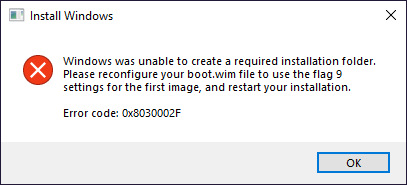
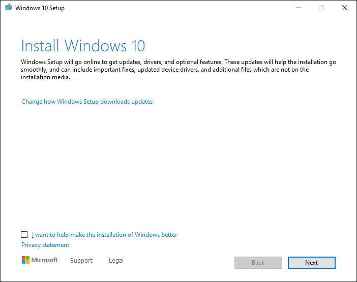
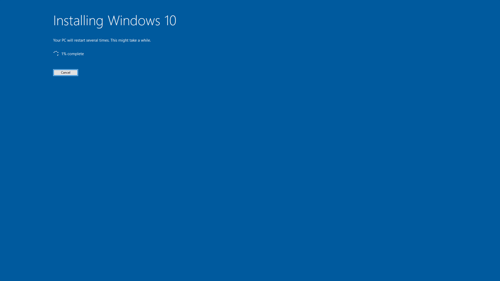

---
hide:
  - navigation
---

# How to upgrade ReviOS to a newer version?

## Information and prerequisites

With newer builds of ReviOS we provide 2 separate ISOs. One for installing a completely new ReviOS instance, and one for upgrading a previous ReviOS version. This way, the users can update their ReviOS instance without reinstalling and losing files.

!!! danger
    ==**This is an EXPERIMENTAL method**==. Upgrading is tested numerous times, but we obviously cannot cover all the edge cases, so use this with caution!

This method is only working if you are upgrading a **previous ReviOS installation** that is at least on the **21H2** Windows version, or a stock Windows (but for that a complete fresh installation is more preferable). Upgrading from **other** custom **tweaked** systems is neither working nor supported. Cross-upgrades, like from ReviOS 10 to 11 or vice versa, should work, but it is not tested. 

And you need **at least 20-25 GB of free space** on the partition you have ReviOS installed (usually called `C:`).

## Step 1: Download the ISO

Download the latest **Upgrade** build of ReviOS 10 or 11 from the [Download page of our website](https://www.revi.cc/revios/download).

==Make sure you download the `Upgrade-only` option. And the `Upgrade` word must be in the file name.==

### Verification

In the File Explorer go where you downloaded the ISO file, and ++shift+"Right-click"++ on an empty space of the window, and select `Open PowerShell window here`. Type in the following command: `#!powershell Get-FileHash -Algorithm MD5 -Path <file name>`, and replace the `<file name>` part with the name of the ReviOS installer file's name. **You can use the ++tab++ button to autocomplete the file name.**

When the command returns with the hash of the file, compare it to the corresponding MD5 hash value on the [Verification page on the Revision website](https://www.revi.cc/revios/download/verify){target=_blank}. If they match, it means the ISO file is not corrupted, you can carry on with the process.

## Step 2: Preparation

To begin with, it is mandatory to **extract the files of the ISO file** on the partition where ReviOS is installed. Either by mounting the image and copying the files out, or with an file archiver software, like [7-Zip](https://www.7-zip.org/). 

This is important, because the **upgrading process will not work just running from the mounted ISO**. 

Another scenarios when it might not work are if you extracted the ISO to a USB or a network mounted drive. So **make sure the files are on your PC**. The easiest way if you just do it on your Desktop.

## Step 3: Starting

Now all you have to do is to **run the `upgrade.bat` file**.

If you get the following error, and you have done everything according to the guide so far, a **restart** usually solves it.

{.center}

So if everything went right, the following should open.

{.center}

Here, just go through with the defaults the installation give you. (Next, Accept, Install)

And you should arrive to the following screen:

==**It isn't actually installing **Windows Server**. ReviOS *tricks* the `setup.exe` file which gives people ability to upgrade to ReviOS 11 builds on hardwares without TPM and SecureBoot**==.

{.center}

From now on, you only need to just wait. For how long is varied by the hardware, since the installer has to duplicate the OS and then set up the new one.

While upgrading, your OS will reboot multiple times.

## Step 4: Finalizing

After upgrading, the OS will run its preparation again, just like the after a fresh installation. By default, ReviOS doesn't remove the Windows.old folder, because some users prefer old version. To clean it up, you can run Disk Cleanup as administrator and choose `Previous Windows installations(s)`, [more information](https://www.thewindowsclub.com/remove-previous-windows-installations).